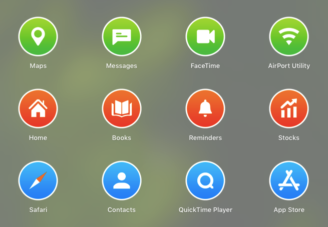

# custom-icon-gen

A dynamic icon pack generator from plain vectors. Customizable styles and colors for icons.


*Icons built with default style*


## Why
I like uniform customizable size and style for all my icons.


## Usage
```sh
git clone https://github.com/notshridhar/custom-icon-gen
cd custom-icon-gen

# optional: create new environment
python3 -m venv env
source ./env/bin/activate

pip install -r requirements.txt
python generate.py [--replace]
```

To generate png images without replacing original icons, run `generate.py` without any arguments. To replace the icons manually, see [replacing icons](https://support.apple.com/en-gb/guide/mac-help/mchlp2313/mac).

To replace the original icons, run `generate.py` with --replace argument. However note that this requires elevated permissions and might also need temporarily [disabling SIP](https://developer.apple.com/documentation/security/disabling_and_enabling_system_integrity_protection).

There are also some exceptions where the new icon is not reflected and only default icon is visible [Details](./issues/5).


## Contributing
Any kind of contribution is welcome. Feel free to create Issues or PRs for adding or improving icons, or for adding custom styles.

See `CONTRIBUTING.md` for extensive details.
